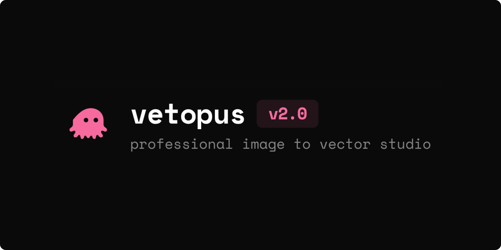

# Vectopus

Vectopus is a browser-based, client-side image-to-vector studio that converts raster images (PNG, JPG, WEBP) into scalable vector graphics (SVG) entirely in the browser. 

The application utilizes canvas-based image preprocessing and advanced tracing configurations to produce clean, optimized SVGs without sending any files to external servers.

## Features

### Interactive Viewport
* **Synchronized Zoom and Pan:** Drag the workspace to pan and scroll to zoom up to 1200% to inspect vector precision directly aligned with original pixels.
* **Split Curtain Slider:** Drag a vertical divider curtain overlay to transition between the original image and the vectorized SVG in real-time.
* **Side-by-Side Comparison:** Compare the source and vector output side-by-side inside independent, synced preview cards.

### Image Preprocessing Pipeline
* **Chroma Key Background Eraser:** Choose between automatic background detection (edge scanning) and custom color extraction.
* **Interactive Eyedropper:** Click directly on the preprocessed preview to pick and erase target background colors.
* **Chroma Tolerance Slider:** Tune the color-matching tolerance boundaries with a smooth transition feather.
* **Contrast and Brightness Filters:** Adjust contrast and brightness sliders to isolate details or outlines.
* **Binarization (Silhouette Mode):** Convert images into high-contrast black-and-white silhouettes before vectorization.

### Advanced Tracing Engine
* **Tracing Presets:**
  * **Logo/Graphic:** Flat solid color tracing with sharp boundaries.
  * **Detailed Vector:** High color depth mapping for complex graphics.
  * **Silhouette:** Solid contrast-mask tracing.
  * **Outline Sketch:** Outline contours with stroke customization.
  * **Retro Pixel Art:** Retains sharp pixel boundaries using right-angle alignment.
* **Custom Engine Tuning:** Adjust color count limits, despeckling noise filters, line/spline smoothing coefficients, and coordinate rounding decimal precision to control file size.

### SVG Inspector
* **Performance Metrics:** View input PNG file size vs output SVG file size, compression ratios, and path complexity.
* **Markup Inspector:** View, copy, or download the raw SVG source code.

## Tech Stack
* **Framework:** TanStack Start (SSR React Meta-framework)
* **Build Tool:** Vite
* **Styling:** TailwindCSS
* **Tracing Library:** ImageTracerJS
* **Icons:** Lucide React

## Getting Started

### Prerequisites
Make sure you have Node.js and npm (or Bun) installed.

### Installation
Clone the repository and install the dependencies:
```bash
npm install --legacy-peer-deps
```

### Running Locally
Run the development server:
```bash
npm run dev
```
Open `http://localhost:8080` in your browser.

### Building for Production
To build the application for production deployment:
```bash
npm run build
```

To preview the production build locally:
```bash
npm run preview
```

## Contributing

Contributions are welcome. Please feel free to submit issues or pull requests to help improve Vectopus:

1. Fork the repository.
2. Create your feature branch (`git checkout -b feature/amazing-feature`).
3. Commit your changes (`git commit -m 'feat: add some amazing feature'`).
4. Push to the branch (`git push origin feature/amazing-feature`).
5. Open a Pull Request.

## License

This project is licensed under the GNU General Public License v3.0 (GPL-3.0) - see the [LICENSE](LICENSE) file for details.
