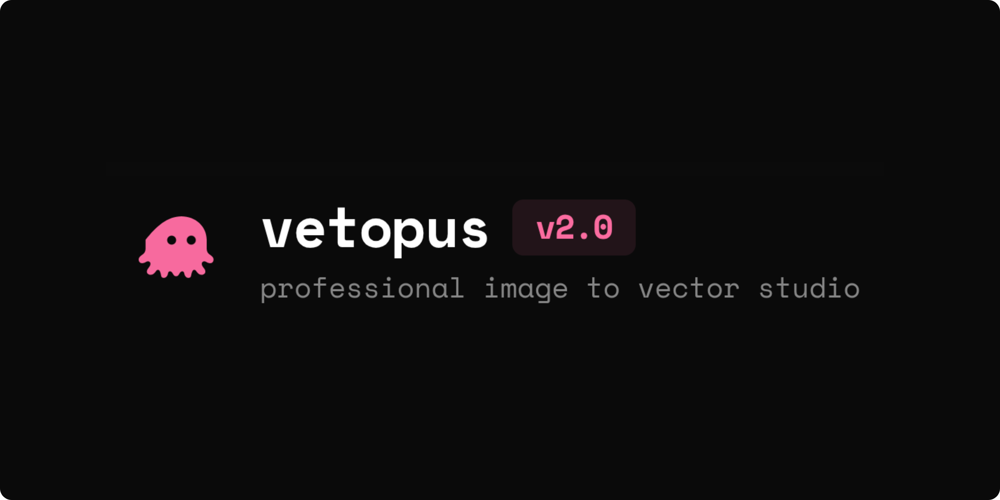
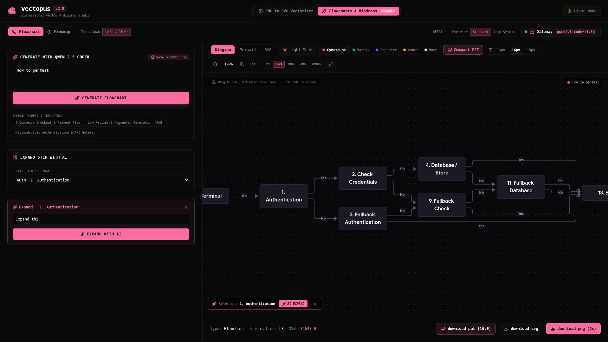
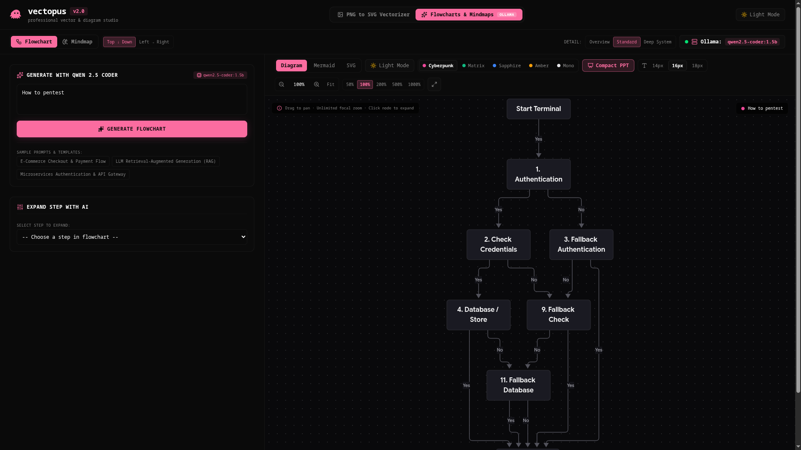
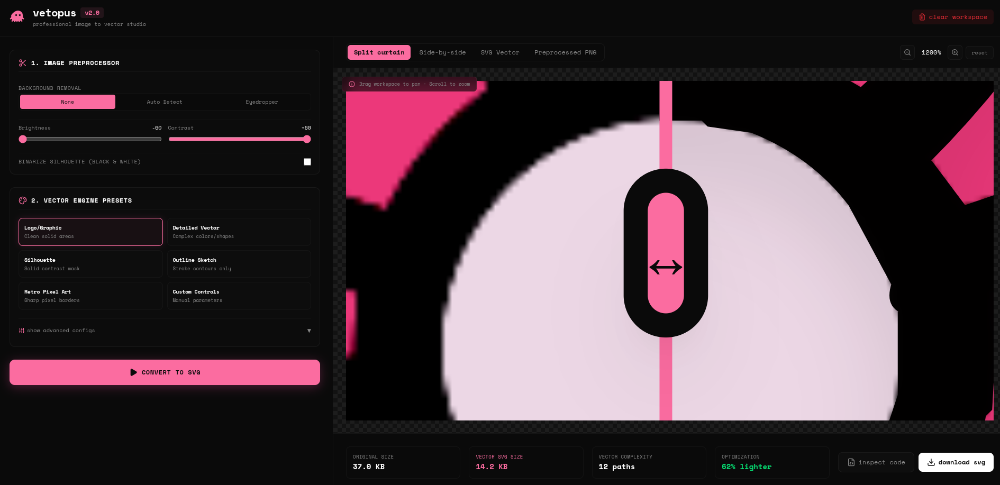
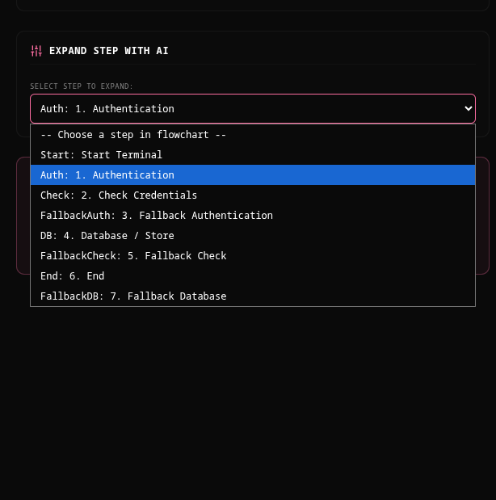

# Vectopus



Vectopus is a high-performance vector and diagram engineering suite. It pairs a client-side raster-to-vector tracer (PNG/JPG/WEBP to SVG) with an AI diagram studio powered by local Ollama models (`qwen2.5-coder:1.5b`).

The entire architecture is containerized and runs 100% locally with Docker Compose—no external AI cloud APIs, subscriptions, or API keys required.

---

## Visual Previews

### Diagram Studio & Architecture Flowcharts


### Compact PPT Mode & Mindmaps


### Raster-to-Vector Preprocessor & Interactive Split View


### AI Node Expansion & Deepening


---

## Core Capabilities

### 1. AI Flowchart & Mindmap Studio
- **Default Flowchart Workspace**: Architectural diagrams, execution pipelines, and dataflows ready on launch.
- **Local Ollama Inference**: Generates clean, robust Mermaid syntax using `qwen2.5-coder:1.5b` with automated syntax self-repair.
- **Node-Level AI Expansion**: Click any flowchart or mindmap node to trigger contextual branch expansion directly from the canvas.
- **Compact PPT Mode**: Reduces spacing (`nodeSpacing: 22`, `rankSpacing: 30`) and optimizes orientation for slide presentations.
- **Presentation Export**: One-click **download ppt (16:9)** slide generation (2880x1620 / 3840x2160) alongside standard vector SVG and high-resolution PNG exports.
- **High-Visibility Typography**: Clean, high-contrast text rendering with selectable font scaling (`14px`, `16px`, `18px`) and zero line glow.
- **Unlimited Viewport Navigation**: Focal-point zoom from `0.002x` to `250x` (`25,000%`) with smooth click-and-drag panning.

### 2. Whole-App Light & Dark Theme
- **Global Theme Engine**: Instant, unified toggle across the entire application interface (toolbars, canvases, cards, typography, and controls).
- **5 Professional Color Palettes**: Cyberpunk, Matrix, Sapphire, Amber, and Monochrome Pro.

### 3. Client-Side Image-to-Vector Studio
- **100% Private & Browser-Native**: Image tracing is processed directly on the client machine via Web APIs and canvas preprocessing.
- **Background Removal**: Auto-detection and interactive eyedropper chroma-key background removal.
- **5 Vectorization Presets**: Optimized profiles for logos, detailed illustrations, black-and-white silhouettes, technical outlines, and pixel art.
- **Interactive Split Slider**: Real-time curtain comparison overlay between the source raster pixels and generated SVG paths.
- **Local AI Vector Refinement**: Prompt-guided SVG simplification, recoloring, and path smoothing via the local model.

---

## Architecture & Docker Setup

Vectopus runs as a completely self-contained Docker multi-container system:

- **vectopus-app**: Next.js 15 standalone application container.
- **vectopus-ollama**: Official Ollama container managing model execution.
- **vectopus-model-init**: Ephemeral bootstrap container that ensures the `qwen2.5-coder:1.5b` weights are downloaded and healthy.

> **Note**: You do not need to install Ollama or Python on your host machine. Docker manages the entire AI inference environment and persistent model storage (`ollama_data` volume).

---

## Installation & Deployment

### Option A: Docker Compose (Recommended)

1. **Clone the repository**:
   ```bash
   git clone https://github.com/spideydotjs/vectopus.git
   cd vectopus
   ```

2. **Start the containers**:
   ```bash
   docker compose up -d
   ```

3. **Access the application**:
   - Open `http://localhost:3000` (or your configured `APP_PORT`).
   - The AI engine will be online and initialized automatically.

4. **Stop the environment**:
   ```bash
   docker compose down
   ```

---

### Option B: Local Host Development

If you prefer to run the Next.js development server directly on your host machine:

1. **Prerequisites**:
   - Node.js 20+
   - Ollama installed locally (or running via Docker on port 11434)

2. **Install dependencies**:
   ```bash
   npm install
   ```

3. **Configure environment variables**:
   Create a `.env.local` file:
   ```env
   OLLAMA_BASE_URL="http://localhost:11434"
   OLLAMA_MODEL="qwen2.5-coder:1.5b"
   ```

4. **Pull the model**:
   ```bash
   ollama pull qwen2.5-coder:1.5b
   ```

5. **Start the development server**:
   ```bash
   npm run dev
   ```
   Open `http://localhost:3000` in your browser.

---

## Production Build Verification

Verify clean static generation and type safety:

```bash
npm run build
```

---

## Tech Stack

- **Framework**: Next.js 15 (App Router, Standalone Output)
- **Language**: TypeScript
- **Styling**: Tailwind CSS v4
- **Diagram Engine**: Mermaid.js with custom layout post-processing
- **Vector Engine**: ImageTracerJS + HTML5 Canvas
- **AI Inference**: Local Ollama daemon (`qwen2.5-coder:1.5b`)
- **Icons**: Lucide React
- **Containerization**: Docker & Docker Compose

---

## License

This project is licensed under the GNU General Public License v3.0 (GPL-3.0). See [LICENSE](LICENSE) for details.
